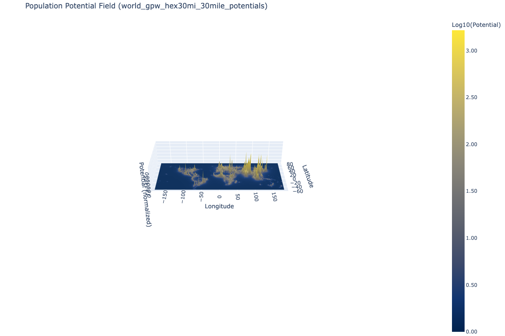

# Population Potential Fields

**Discovering hidden geographic structure through distance-weighted population analysis**

[](https://jspenc4.github.io/javaMap/)



## Overview

This project explores what happens when you calculate cumulative population potential using a 1/d³ distance weighting. The results reveal geographic structures that traditional population maps don't show:

- **Linear ridges** along the Nile Valley and Java's populated corridor
- **Cross-border megalopolises** like San Diego/Tijuana appearing as unified peaks
- **Polycentric structures** revealing cultural regions (Nigeria's three distinct peaks)
- **Hierarchical organization** at multiple scales—what merges at 15 miles vs 30 miles reveals different urban phenomena

The method is simple: at every location, sum the population of all other locations divided by distance cubed. Despite this simplicity, it consistently discovers real geographic features across wildly different datasets.

## Visualizations

### Spider Web Network Maps

Lines connecting merged population centers, colored by merge order.


*74,000 US census tracts merging hierarchically*


*Global population at 15 arc-minute resolution*

### 3D Population Potential Surface

Population distribution rendered as elevation, where height represents cumulative population potential.


*Western Hemisphere population potential*

## Key Findings

The algorithm naturally discovers:

- **Continental regions** (South Asia 1.8B, East Asia 1.5B, Western Hemisphere 927M)
- **Natural barriers** (deserts, oceans, mountain ranges) as low-density boundaries
- **Cultural corridors** (Grand Trunk Road in South Asia emerges as coherent 1B+ person region)
- **Metropolitan structure** (urban cores, suburbs, satellite cities)
- **Micro-geography** (Central Park divides Manhattan neighborhoods)

**Cross-validation:** Census tracts, block groups, and world grid data all converge on the same regional boundaries, confirming the algorithm captures real geographic structure.

## The Method

### Population Potential Calculation

```
potential(location) = Σ (population_i / distance(location, i)^3)
```

At every location, we sum contributions from all population sources, weighted by the inverse cube of distance. This heavy distance weighting (1/d³) emphasizes nearby populations while still allowing longer-range effects.

**Why 1/d³?** This comes from a 1/d⁴ force law, which has a special property: **scale invariance under grid coarsening**.

Consider a regular 2D grid with one person per point. Neighboring points attract with force = (1×1)/1⁴ = 1. Now coarsen to half resolution (every other gridpoint in each dimension): each point now represents 4 people, neighbors are 2 units apart, so force = (4×4)/2⁴ = 16/16 = 1. Same force, different resolution.

This means the strongest-attraction pairs are resolution-independent—you get the same hierarchical structure whether you use fine or coarse population data. The 1/d⁴ force law integrates to 1/d³ potential.

### Hierarchical Clustering (Original Java Implementation)

The clustering algorithm discovers hierarchical structure by iteratively merging population centers:

1. Start with individual census tracts/grid cells as separate regions
2. Calculate pairwise potential between all regions using 1/d⁴ force law
3. Merge the pair with highest potential
4. Update centroid (population-weighted) and recalculate potentials
5. Repeat until all regions merged into one

**Output:** Complete merge tree showing hierarchical structure at all scales—which neighborhoods merge first, then cities, then metro areas, then regions.

### Distance Calculation

Approximate spherical distance optimized for speed:

```java
xMiles = deltaLon × 69.0 × cos(averageLatitude)
yMiles = deltaLat × 69.172
distance² = xMiles² + yMiles²
```

Cosine lookup table for latitudes 0-89° avoids repeated trig calculations.

### Performance

- **Complexity:** O(n²) with aggressive caching
- **Cache strategy:** Store potentials for large merged regions (>100 members)
- **Memory management:** Release merged tract contents to handle large datasets

## Data Sources

- **US Census Bureau:** Census tracts (~74k) and block groups (~220k)
- **GPW v4:** Gridded Population of the World (CIESIN)
  - 15 arc-minute resolution (~28km at equator, ~1 million grid cells)
  - 2015 population adjusted to UN estimates

## Project Structure

```
lib/                        # Python library
├── constants.py            # Earth distance constants
├── geometry.py             # Distance calculations (cosine-corrected, haversine)
├── potential.py            # Potential field calculation (chunked, vectorized)
└── io.py                   # CSV loading utilities

tests/                      # Python test suite
├── test_geometry.py        # Distance function tests
├── test_potential.py       # Potential calculation tests
├── test_io.py              # File I/O tests
└── test_regression.py      # Regression baselines

src/
├── cli/                    # Python CLI tools
│   ├── calculate_potential.py   # Population potential calculator
│   └── generate_3d_surface.py   # 3D visualization generator
└── com/jimspencer/         # Java implementation (original)
    ├── Tracts.java         # Main clustering algorithm with caching
    ├── Tract.java          # Individual tract or merged region
    ├── SpiderMap.java      # Alternative edge-based approach
    ├── MapEdge.java        # Adjacency between tracts
    └── Region.java         # Region merging by boundary distance

experiments/                # Experimental scripts (organized by category)
├── 3d_export/              # OBJ, STL, point cloud exports
├── 3d_print/               # Blender integration, print previews
├── triangulation/          # Delaunay triangulation utilities
├── visualization/          # Regional visualizations, color exports
├── regional_analysis/      # Specific region investigations
├── triangle_centers/       # Triangle center calculations
├── exclude_experiments/    # Exclusion parameter experiments
└── misc/                   # Utility scripts

res/
├── censusTracts.csv        # Input: US census tract data
├── treeOutput.csv          # Output: sequential merge records
├── tracts_sf_bay.csv       # SF Bay Area subset for testing
├── 74k_us.pdf              # US spider web visualization
├── worldPrintMap.pdf       # World spider web (colored)
├── 3dsurface.png           # 3D potential surface
└── usa6region.jpg          # Physical map with 6 hand-drawn regions

docs/
├── INTERNAL-NOTES.md       # Project organization reference
└── world tree.docx         # Annotated world hierarchy (to 3M pop)
```

## Usage

### Python Library (Recommended)

**Installation:**
```bash
# Install dependencies
pip install numpy scipy pandas pytest

# Run tests
pytest tests/ -v
```

**Basic Usage:**
```python
from lib import io, potential, geometry

# Load census data
df = io.load_csv('res/tracts_sf_bay.csv')
lons = df['LONGITUDE'].values
lats = df['LATITUDE'].values
weights = df['POPULATION'].values

# Calculate population potential at each census tract
# force_exponent=3 means 1/d³ potential (derived from 1/d⁴ force law)
potentials = potential.calculate_potential_chunked(
    sample_lons=lons,
    sample_lats=lats,
    source_lons=lons,
    source_lats=lats,
    source_weights=weights,
    distance_fn=geometry.cos_corrected_distance,
    force_exponent=3,  # 1/d³ potential
    chunk_size=1000    # Process 1000 points at a time
)

print(f"Potential range: {potentials.min():.0f} to {potentials.max():.0f}")
```

**API Reference:**

`calculate_potential_chunked(sample_lons, sample_lats, source_lons, source_lats, source_weights, distance_fn, force_exponent=3, chunk_size=1000, min_distance_miles=0.0, max_distance_miles=None)`

- **sample_lons/lats**: Where to calculate potential (e.g., triangle centers, census tracts)
- **source_lons/lats/weights**: Population sources (census tracts with populations)
- **distance_fn**: `cos_corrected_distance` (fast) or `haversine_distance` (accurate)
- **force_exponent**: Exponent for potential calculation (3 = 1/d³, recommended for population potential)
- **chunk_size**: Memory management (1000 works for 48GB RAM with 72k points)
- **min_distance_miles**: Smooth noise by clamping distances (e.g., 1.0 mile for census centroids)
- **max_distance_miles**: Limit to local influences (e.g., 50-100 miles)

**Distance Functions:**
- `cos_corrected_distance`: Fast approximation using cosine correction (~3× faster)
- `haversine_distance`: Accurate great-circle distance (use for scientific work)

**Smoothing Census Centroid Noise:**
```python
# Census tract centroids are approximate (±0.5-1 mile error)
# Use min_distance_miles to smooth this noise
potentials = potential.calculate_potential_chunked(
    lons, lats, lons, lats, weights,
    geometry.cos_corrected_distance,
    force_exponent=3,
    min_distance_miles=1.0  # Treat anything <1 mile as 1 mile away
)
```

**Advanced Options (pre-computed distances):**
```python
# For custom workflows, use pre-computed distance matrix
distances = geometry.cos_corrected_distance(sample_lons, sample_lats, source_lons, source_lats)
potentials = potential.calculate_potential(
    distances,
    weights,
    force_exponent=3,
    max_distance_miles=100,      # Zero contribution beyond distance
    min_distance_miles=1.0       # Smooth census noise
)
```

### Java Implementation (Original)

```bash
# Compile
javac -d out src/com/jimspencer/*.java

# Run (edit Tracts.java to select input file)
java -cp out com.jimspencer.Tracts
```

**Input:** CSV with `LONGITUDE,LATITUDE,POPULATION`
**Output:** `res/treeOutput.csv` with merge sequence

### Generating Visualizations

The tree output can be rendered as:
- GeoJSON MultiLineString for web mapping
- PDF using vector graphics tools
- Interactive visualizations (D3.js, Observable, etc.)

See `docs/INTERNAL-NOTES.md` for details on visualization workflow.

## World Population Hierarchy

Top-level structure discovered by the algorithm:

1. **South Asia** (1.8B) — Grand Trunk Road corridor, India/Pakistan/Bangladesh
2. **East Asia** (1.5B) — China, Japan, Korea
3. **Western Hemisphere** (927M) — North/Central/South America
4. **Europe & Middle East** (909M) — Benelux to Tehran, Mediterranean
5. **East Africa** (464M) — Great Lakes, Ethiopia, Mozambique corridor
6. **West Africa** (409M) — Nigerian coast, Sahel
7. **Independent Areas** — Indonesia (245M), SE Asia (109M), Philippines (103M)
8. **Isolated** — Australia (21M), Pacific Northwest (14M), New Zealand (5M)

Complete hierarchy annotated down to 3M population in `docs/world tree.docx`. The algorithm continues to individual tracts but manual annotation became tedious.

## What the Analysis Reveals

### Geographic Structure Emerges Naturally

Despite using only population and distance, the potential field method discovers:

- **Grand Trunk Road corridor** — India/Pakistan/Bangladesh emerge as coherent 1B+ person region
- **Cultural boundaries** — Florida separates from Deep South; Nigeria shows three distinct peaks
- **Physical barriers** — Middle East/Indian subcontinent gap aligns with desert; oceans create natural boundaries
- **Genuine ambiguity** — Denver and Salt Lake City don't clearly "belong" to any region, reflecting their actual geographic position

### Scale-Dependent Hierarchies

What merges at different distance scales reveals different phenomena:
- **3-5 miles**: Neighborhood structure within cities
- **15 miles**: Metropolitan regions and satellite cities
- **30 miles**: Megalopolitan corridors
- **100+ miles**: Continental regions

The same algorithm running at different scales extracts different meaningful geographic patterns.

## Technical Notes

### Known Artifacts

**Equatorial gridding:** Early merges in gridded data show slight horizontal bias at the equator (E-W neighbors equally likely). Not visible at normal viewing distance and doesn't affect regional structure.

**Line crossings:** Spider web lines occasionally cross. This is correct—the algorithm uses potential (not pure geography) so attachment points may seem counterintuitive but reflect population attraction.

### Validation

Cross-validation across multiple datasets confirms robustness:
- US census tracts (74k)
- US block groups (220k)
- World 15 arc-minute grid (~1 million cells)

All converge on the same major regional boundaries.

## Empirical Validation (2025)

### Scale Invariance Confirmed

The 1/d⁴ force law was chosen specifically for its theoretical scale invariance (see grid coarsening argument above). Testing with real US census data at different resolutions confirms this works in practice:

| Dataset | Points | NYC Peak | LA Peak | SF Peak |
|---------|--------|----------|---------|---------|
| Census Tracts | 72,539 | 511,079 | 258,125 | 226,560 |
| Block Groups | 216,273 | 509,437 | 257,986 | 226,910 |
| **Difference** | **3.0x** | **0.3%** | **0.05%** | **0.1%** |

**Result:** Tripling the number of data points changes peak potential values by less than 1%. The theoretical prediction holds with real-world data—the method captures geographic structure, not census artifacts.

**Technical note:** This consistency requires `min_distance_miles=1.0` smoothing to handle noise in census centroid locations (±0.5-1 mile precision). Without smoothing, self-contribution from a tract's own population dominates, obscuring regional patterns.

### Performance Optimizations

**Parallel Processing:** Block groups (216k × 216k = 47B calculations)
- 2 cores, no max_distance: 7.7 minutes
- 4 cores, 100-mile cutoff: 4.9 minutes (36% speedup)
- Result difference: <0.01%

**Recommendation:** Use `max_distance_miles=100` for large-scale calculations. Beyond 100 miles, contributions are negligible with force_exponent=3.

### City Rankings (1-mile smoothing)

| Rank | City | Peak Potential | Neighborhood |
|------|------|----------------|--------------|
| 1 | New York | 509,000 | Upper West Side / Yankee Stadium area |
| 2 | Los Angeles | 258,000 | Downtown LA |
| 3 | San Francisco | 227,000 | Mission District |
| 4 | Philadelphia | 188,000 | Center City / Rittenhouse Square |
| 5 | Chicago | 180,000 | Near North Side / Gold Coast |
| 6 | Boston | 175,000 | Downtown / Financial District |
| 7 | DC | 159,000 | Shaw / U Street |

**Most remote locations:** Fort McDermitt, NV and remote Montana both scored potential = 2 (vs NYC's 509,000).

### 3D Printing Plans

First physical models in progress:
- Bambu Lab P1S with AMS (4-color capability)
- Plan: Print USA map with height = population potential
- Color scheme: Blue (remote) → Cyan → Yellow → Red (dense)
- Expected print time: 12-24 hours for full USA at high detail

## Future Development

- [ ] Interactive web visualization with zoom/drill-down
- [ ] "Crystal growth" animation of merge sequence
- [ ] Temporal analysis with historical population data
- [ ] Alternative metrics (travel time, economic gravity)
- [ ] Census blocks analysis (~2.5M points, 2-3 day compute with 8 cores)
- [ ] Code refactoring and test coverage

## Contributing

This is currently a personal research project. If you're interested in collaborating, extending the work, or using it for academic research, please reach out.

## License

[To be determined]

## Background and Related Work

This work uses distance-weighted population metrics, an approach with roots in economic geography and regional science. The 1/d⁴ force law (giving 1/d³ potential) was derived from the requirement of scale invariance under grid coarsening—the same hierarchical structure should emerge regardless of data resolution.

Similar concepts appear in:
- Regional accessibility metrics in transportation planning
- Market potential models in economic geography
- Urban gravity models for commuting patterns
- Stewart-Warntz population potential (though that typically uses 1/d rather than 1/d³)

The hierarchical clustering algorithm and the scale invariance argument are original work from 2015-2021.

## Citation

If you use this work:

```
Spencer, J. (2015-2025). Population Potential Fields: Hierarchical Geographic Structure
Through Distance-Weighted Analysis. https://github.com/jspenc4/javaMap
```

## Acknowledgments

Thanks to:
- The printer guy who thought it was cool
- My spouse for tolerating this obsession
- Everyone who's looked at these visualizations and said "wait, that's actually interesting"

---

*"It made me pretty happy, might bring joy to others."*
